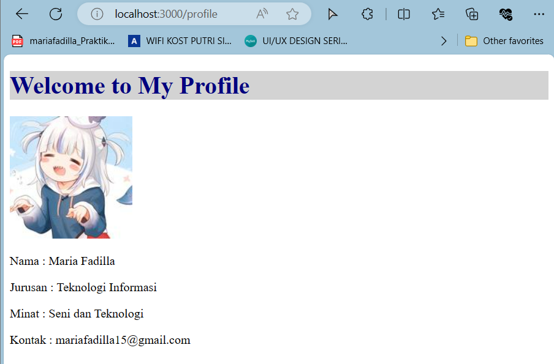

# 05-routing

#### For Others Project, Please Visit: 
https://github.com/mariafadilla15/Pemrograman-Berbasis-Framework.git

<br><br>


# **Laporan Praktikum - #05 React Router**

|  | Pemrograman Berbasis Framework 2024 |
|--|--|
| NIM |  2141720063|
| Nama |  Maria Fadilla |
| Kelas | TI - 3A |


## **Praktikum 1: Membuat Routing Sederhana**

Mempersiapkan project dengan memanfaatkan template repository yang telah dipersiapkan di alamat https://github.com/dhanifudin/routing-demo dan menggunakan tombol Use this template kemudian memilih Create a new repository.

- Nama Reposiotry: `05-routing`

Clone repository

`git clone https://github.com/mariafadilla15/05-routing.git`

Menjalankan dependencies

`npm install`


Menambahkan file `page.tsx` di dalam folder app, dan membuat komponen dengan kode berikut:

```bash
export default function Home() {
  return <h1>Welcome to Home</h1> ;
}
```

Menjalankan project

`npm run dev`


Membuat halaman routing `/about` dengan NextJS, dengan membuat folder `/about` dalam `/app` dan membuat file dengan nama `page.tsx`. Kemudian membuat function komponen seperti pada kode berikut:

```bash
export default function About() {
  return <h1>Welcome to About</h1> ;
}
```


### **To do (1)**

Membuat halaman `/profile` yang menampilkan isi biodata dengan menggunakan routing di NextJS.

```bash
export default function Profile() {
    const biodata = {
        nama: "Maria Fadilla",
        jurusan: "Teknologi Informasi",
        minat: "Seni dan Teknologi",
        kontak: "mariafadilla15@gmail.com",
    };

    return (
        <div>
            <h1>Welcome to My Profile</h1>
            <p>Nama    : {biodata.nama}</p>
            <p>Jurusan : {biodata.jurusan}</p>
            <p>Minat   : {biodata.minat}</p>
            <p>Kontak  : {biodata.kontak}</p>
        </div>
    );
}
```

Hasil tampilannya adalah sebagai berikut:

