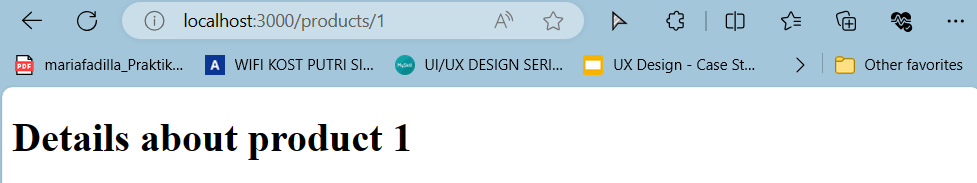

# 05-routing

#### For Others Project, Please Visit: 
https://github.com/mariafadilla15/Pemrograman-Berbasis-Framework.git

<br><br>


# **Laporan Praktikum - #05 React Router**

|  | Pemrograman Berbasis Framework 2024 |
|--|--|
| NIM |  2141720063|
| Nama |  Maria Fadilla |
| Kelas | TI - 3A |

<br>

## **Praktikum 1: Membuat Routing Sederhana**
---

Mempersiapkan project dengan memanfaatkan template repository yang telah dipersiapkan di alamat https://github.com/dhanifudin/routing-demo dan menggunakan tombol Use this template kemudian memilih Create a new repository.

- Nama Reposiotry: `05-routing`

Clone repository

`git clone https://github.com/mariafadilla15/05-routing.git`

Menjalankan dependencies

`npm install`


Menambahkan file `page.tsx` di dalam folder app, dan membuat komponen dengan kode berikut:

```bash
export default function Home() {
  return <h1>Welcome to Home</h1> ;
}
```

Menjalankan project

`npm run dev`


Membuat halaman routing `/about` dengan NextJS, dengan membuat folder `/about` dalam `/app` dan membuat file dengan nama `page.tsx`. Kemudian membuat function komponen seperti pada kode berikut:

```bash
export default function About() {
  return <h1>Welcome to About</h1> ;
}
```


### **To do (1)**

Membuat halaman `/profile` yang menampilkan isi biodata dengan menggunakan routing di NextJS.

```bash
const baseUrl = 'https://i.imgur.com/';
const biodata = {
    imageId: '5Q2oUMg',
    imageSize: 'b',
    nama: "Maria Fadilla",
    jurusan: "Teknologi Informasi",
    minat: "Seni dan Teknologi",
    kontak: "mariafadilla15@gmail.com",
    headingStyle: {
        backgroundColor: 'lightGrey',
        color: 'navy'
    },
};

export default function Profile() {

    const { headingStyle } = biodata;

    return (
        <div>
            <div style={headingStyle}>
                <h1>Welcome to My Profile</h1>
            </div>
            <div>
                
                <p>Nama    : {biodata.nama}</p>
                <p>Jurusan : {biodata.jurusan}</p>
                <p>Minat   : {biodata.minat}</p>
                <p>Kontak  : {biodata.kontak}</p>
            </div>
        </div>
    );
}
```

- Hasil tampilannya adalah sebagai berikut:


## **Praktikum 2: Membuat routing bersarang (Nested Routing)**
---

Menambahkan susunan folder `/blogs/first` dan `/blogs/second`. Kemudian menambahkan masing-masing untuk setiap folder dengan file `page.tsx`.


Membuat function component pada file `/blogs/page.tsx`.

```bash
const baseUrl = 'https://www.urbanplus.co.id/wp-content/uploads/2022/08/ikn_sip_02.jpg';

const artikel = {
    headingStyle: {
        backgroundColor: 'lightGrey',
        color: 'navy'
    },
    judul: "A Global City For All: Nusantara Capital City (IKN)",
    isi: (
        <div>
            <p>
                Terletak di pantai timur Kalimantan, Ibu Kota Nusantara (IKN) adalah proyek ambisius Indonesia yang dirancang sebagai kota pintar yang berkelanjutan dan inklusif. Sebagai pusat pemerintahan baru yang juga menjadi simbol identitas nasional, IKN mengintegrasikan teknologi canggih dan prinsip-prinsip ramah lingkungan, dengan visi untuk menjadi kota global yang menjanjikan kemajuan, keberlanjutan, dan harmoni bagi semua warganya.
            </p>
            <p>
                IKN bertujuan untuk menciptakan lingkungan yang ramah, inklusif, dan berkelanjutan bagi penduduknya. Dengan pendekatan yang holistik, IKN tidak hanya memperhatikan infrastruktur fisik, tetapi juga menitikberatkan pada aspek sosial, ekonomi, dan lingkungan. Melalui penggunaan teknologi terkini dan prinsip-prinsip desain yang ramah lingkungan, IKN berusaha menjadi contoh bagi kota-kota lain di dunia.
            </p>
            <p>
                Sebagai pusat pertumbuhan ekonomi dan inovasi, IKN menawarkan peluang tak terbatas bagi para penduduknya. Dengan fokus pada pengembangan sumber daya manusia dan industri kreatif, IKN bertujuan untuk menciptakan ekosistem yang mendukung pertumbuhan ekonomi yang inklusif dan berkelanjutan.
            </p>
        </div>
    )
};

export default function Blog() {
    const { headingStyle } = artikel;
    return (
        <div>
            <div style={headingStyle}>
                <h1>Welcome to My Blog</h1>
            </div>
            <div>
                
            </div>
            <h2>{artikel.judul}</h2>
            {artikel.isi}
        </div>
    );
}
```

Membuat function component pada file `/blogs/first/page.tsx`.

```bash
const baseUrl = 'https://i.imgur.com/';

const artikel = {
    imageId: 'G0doLms',
    imageSize: 'm',
    judul: "Time For Healing: Finding Peace on the Beach",
    isi: (
        <div>
            <p>
                Liburan ke pantai seringkali dianggap sebagai salah satu cara terbaik untuk melepas penat dan menemukan kedamaian. Dengan deburan ombak yang menenangkan, pasir yang lembut di bawah kaki, dan panorama matahari terbenam yang memukau, pantai menjadi tempat sempurna untuk refreshing.
            </p>
            <p>
                Berjalan di tepi pantai sambil mendengarkan suara alam, dapat membantu kita melupakan sejenak hiruk-pikuk kehidupan sehari-hari. Ini adalah waktu untuk menyembuhkan, baik secara fisik maupun emosional, dan untuk mengisi ulang energi kita.
            </p>
            <p>
                Pantai juga menawarkan berbagai aktivitas yang dapat meningkatkan kesehatan mental kita, seperti berjalan kaki di tepi air, berenang, atau sekadar duduk dan membaca buku. Tidak ada yang lebih menyegarkan daripada menghirup udara segar pantai dan merasakan sinar matahari yang hangat di kulit.
            </p>
            <p>
                Jadi, jika Anda merasa lelah dan ingin menyegarkan pikiran, pertimbangkan untuk berwisata ke pantai. Biarkan alam melakukan sihirnya dan bawa pulang kenangan indah serta semangat baru untuk menghadapi tantangan yang akan datang.
            </p>
        </div>
    ),
    headingStyle: {
        backgroundColor: 'lightGrey',
        color: 'navy'
    },
};

export default function BlogFirst() {
    const { headingStyle } = artikel;
    return (
        <div>
            <div style={headingStyle}>
                <h1>Blogs: First</h1>
            </div>
            <div>
                
            </div>
            <h2>{artikel.judul}</h2>
            {artikel.isi}
        </div>
    );
}
```

Mengakses halaman `/blogs` dan `/blogs/first` pada browser.

- `/blogs`


- `/blogs/first`


### **To do (2)**

Melengkapi function component pada `/blogs/second/page.tsx`.

```bash
const baseUrl = 'https://i.imgur.com/';

const artikel = {
    imageId: 'Ck7b5jN',
    imageSize: 'm',
    judul: "Cultivating Creativity: The Art Forms We Must Sustain",
    isi: (
        <div>
            <p>
                Kesenian merupakan warisan berharga yang mencerminkan kekayaan budaya dan sejarah suatu bangsa. Dari tarian tradisional yang anggun hingga seni ukir yang rumit, setiap bentuk kesenian membawa cerita dan nilai-nilai yang telah diwariskan turun-temurun.
            </p>
            <p>
                Di era modern ini, penting bagi kita untuk terus membudidayakan dan melestarikan kesenian agar tidak tergerus oleh arus globalisasi. Kesenian bukan hanya soal estetika, tetapi juga tentang mempertahankan identitas dan memperkaya kehidupan sosial masyarakat.
            </p>
            <p>
                Melalui pembudidayaan kesenian, kita dapat membangun jembatan antara masa lalu dan masa kini, serta menginspirasi generasi yang akan datang untuk terus menghargai dan mengembangkan warisan budaya yang unik ini.
            </p>
            <p>
                Mari kita dukung para seniman dan lembaga kesenian, berpartisipasi dalam kegiatan seni, dan terlibat langsung dalam proses kreatif. Dengan demikian, kita dapat memastikan bahwa keindahan kesenian akan terus hidup dan berkembang, membawa pesona dan pesan bagi banyak generasi yang akan datang.
            </p>
        </div>
    ),
    headingStyle: {
        backgroundColor: 'lightGrey',
        color: 'navy'
    },
};

export default function BlogSecond() {
    const { headingStyle } = artikel;
    return (
        <div>
            <div style={headingStyle}>
                <h1>Blogs: Second</h1>
            </div>
            <div>
                
            </div>
            <h2>{artikel.judul}</h2>
            {artikel.isi}
        </div>
    );
}
```

- Hasil tampilannya adalah sebagai berikut:


### **Jawaban Pertanyaan**

Pertanyaan: Apa kekurangan yang mungkin terjadi jika menggunakan pendekatan pada Praktikum 2 untuk menangani routing?

- Beberapa kekurangan yang mungkin terjadi jika menggunakan pendekatan pada Praktikum 2 untuk menangani routing, diantaranya:

  - Kesulitan Navigasi yang Kompleks: Manajemen navigasi menjadi sulit saat jumlah routing bersarang meningkat.
  - Potensi Konflik Nama Halaman: Risiko terjadinya konflik nama halaman jika nama halaman sama di tingkatan yang berbeda.
  - Pengaruh Terhadap Kinerja: Routing bersarang dapat mempengaruhi kinerja aplikasi karena setiap perubahan URL memicu proses rendering ulang.
  - Kesulitan dalam Pemeliharaan: Semakin kompleks struktur routing, semakin sulit untuk memelihara dan memperbarui kode, serta melacak dampak perubahan pada struktur routing.

## **Praktikum 3: Membuat routing dinamis (Dynamic Routing)**
---

Membuat file `/products/page.tsx` yang berisi function component untuk menampilkan list dari products.

- `src>app>products>page.tsx`

```bash
export default function ProductList() {
  return (
        <div>
          <h1>Product List</h1>
          <h2>Product 1</h2>
          <h2>Product 2</h2>
          <h2>Product 3</h2>
        </div>
  );
}
```

Membuat file `page.tsx` pada lokasi `/app/products/[productId]`

- `src>app>products>[productId]>page.tsx`

```bash
type Props = {
  params: {
        productId: string
  }
}

export default function ProductDetails({ params }: Props) {
  return (
        <h1>Details about product {params.productId}</h1>
  )
}
```

Mengakses halaman `/products` dan `/products/1` pada browser. 

- `/products`


- `/products/1`



Mengubah nilai `productId` dengan nilai lainnya.

- `/products/marfad`


### **To do (3)**

Memperbaiki implementasi Praktikum 2 menggunakan Dynamic Routes

- `src>app>blogs>[blogId]>page.tsx`

```bash
type Props = {
    params: {
          blogId: string
    }
}
  
export default function BlogDetails({ params }: Props) {
    return (
          <h1>Hello, this is {params.blogId} Blog</h1>
    )
}
```

- Hasil tampilannya adalah:


### **To do (4)**

Membuat halaman dengan routing `/products/[productId]/reviews/[reviewId]` dengan menggunakan konsep Nested Routes dan Dynamic Routes.

- `src>app>products>[productId]>reviews>page.tsx`

```bash
export default function Reviews() {
    return (
          <div>
            <h1>Review List</h1>
            <h2>Review 1</h2>
            <h2>Review 2</h2>
            <h2>Review 3</h2>
          </div>
    )
}
```

- Hasil tampilan `/products/[productId]/reviews`


- `src>app>products>[productId]>reviews>[reviewId]>page.tsx`

```bash
type Props = {
    params: {
      productId: string
      reviewId: string
    }
  }
  
  export default function ProductDetails({ params }: Props) {
    return (
          <h1>Details about product {params.productId} review {params.reviewId}</h1>
    )
}
```

- Hasil tampilann `/products/[productId]/reviews/[reviewId]`


